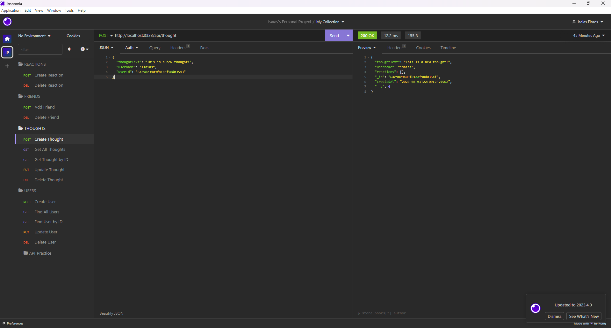

# social_network_API
  ## Licence:
  

  ## Description
 

  ## Table of Contents
  - [Installation](#installation)
  - [Usage](#usage)
  - [Credits](#credits)

  ## Installation
  This is a screenshot of the application being tested:

  - This is the link to the video:
  https://drive.google.com/file/d/1uhlajkP6AU0qBTtl7azYvqyQW1BoBdfi/view
  

  ## Usage
  - Just run it locally by cloning the repo.
  - You need to run the code node ./index.js in your console.
  - Finally you can use any open-source tool used for testing and debugging HTTP APIs. 

  ## Credits
  N/A
